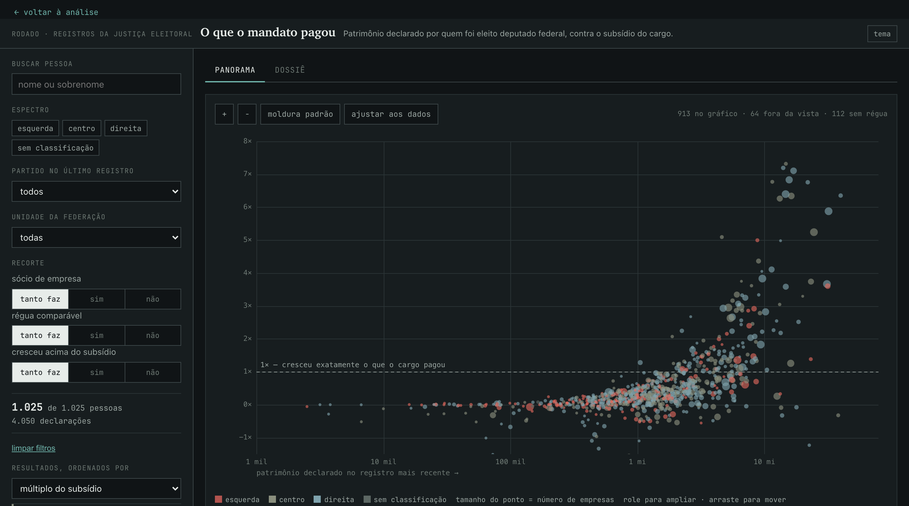

# O que o mandato pagou

Painel interativo do patrimônio declarado por quem foi eleito deputado federal,
medido contra o subsídio que o cargo depositou no mesmo período.

**No ar em [rodado.xyz/analises/patrimonio](https://rodado.xyz/analises/patrimonio/)**



## A pergunta

Todo candidato entrega à Justiça Eleitoral a lista de bens que declara possuir.
Quem se elege deputado federal recebe um subsídio de valor público, fixado por
decreto legislativo. Juntando as duas coisas dá para perguntar uma coisa
simples: **entre uma declaração e a seguinte, o patrimônio cresceu mais ou menos
do que o cargo pagou?**

A resposta é o *múltiplo do subsídio*, o eixo vertical do painel. Em 1× o
patrimônio cresceu exatamente o que o mandato depositou. Acima de 1× cresceu
mais. Isso não é acusação de nada: sobra salário de antes, herança, venda de
bem, ganho de capital, renda do cônjuge, empresa que deu lucro. O painel serve
para encontrar o caso que merece pergunta, não para respondê-la.

## O que tem aqui

1.025 pessoas, 4.050 declarações, de 2010 a 2026. O universo é quem foi eleito
deputado federal em alguma eleição de 2006 a 2022 — e a série traz **todas** as
candidaturas que essas pessoas registraram no período, inclusive a prefeito e a
vereador, porque toda candidatura carrega declaração de bens.

- **Panorama** — patrimônio contra múltiplo do subsídio, uma bolha por pessoa,
  cor por espectro partidário e tamanho por número de empresas. Rola para
  ampliar, arrasta para mover.
- **Dossiê** — a ficha de uma pessoa: a série no tempo, a composição de cada
  declaração nas sete categorias de bem, as empresas em que consta no quadro
  societário e a tabela eleição a eleição. Cada pessoa tem endereço próprio e
  compartilhável (`#d=nome-da-pessoa`).
- **Recortes** — sócio de empresa, régua comparável e crescimento acima do
  subsídio, cada um com três posições (sim / tanto faz / não). O estado inteiro
  do painel vive na URL, então qualquer vista dá link.

## Por que a série começa em 2010

Em 2006 e 2008 o `sequencial_candidato` **não é único** na tabela de candidatos
do TSE: 19.204 linhas para 3.162 sequenciais distintos em 2006, 381.250 para
68.551 em 2008. Como é essa a chave que liga candidato a bem declarado, juntar
por ela nesses dois anos espalha os bens de uma pessoa por dezenas de outras. O
sintoma foi um patrimônio de R$ 132.386.000 aparecendo idêntico em duas pessoas
diferentes. De 2010 em diante a chave é única e o cruzamento fecha.

## Ressalvas que o painel não esconde

**Os valores são nominais**, a custo de aquisição, como manda a regra do imposto
de renda. Não são corrigidos por inflação — e corrigir seria errado: imóvel
comprado em 1990 está declarado a preço de 1990.

**A régua é o subsídio bruto**, antes de imposto e previdência, e só conta os
meses de mandato *federal*. Período em mandato municipal ou estadual não soma
nada, porque o valor desses cargos não é conhecido aqui — o ponto sai marcado
como régua parcial em vez de fingir que o período foi de graça.

**As empresas são indício, não fato.** Vêm do quadro societário da Receita
Federal, casadas por nome e seis dígitos do CPF: há risco de homônimo. O CNPJ
fica de fora de propósito, para não dar à ligação uma precisão que ela não tem.
O capital social é o declarado no contrato social — não é faturamento nem a
participação da pessoa nele.

**2026 está incompleto.** O prazo de registro se encerra em 15/08/2026 e o
arquivo do TSE ainda cresce a cada dia. Ausência de alguém em 2026 não é
ausência de bem: é candidatura ainda não registrada. Esses pontos saem marcados
como provisórios.

**Ausência não é zero.** Pessoa sem declaração num ano pode simplesmente não ter
concorrido àquela eleição.

## De onde vem o dado

| fonte | o quê |
|---|---|
| TSE, `bens_candidato` | as declarações de bens, 2010–2024 |
| TSE, `candidatos` e `resultados_candidato_municipio` | CPF, nome, UF, partido, cargo e quem se elegeu |
| TSE, dados abertos do ciclo de 2026 | as candidaturas de 2026, ainda em protocolo |
| Receita Federal, CNPJ | quadro societário e capital social |
| Decretos legislativos | a tabela de vigências do subsídio parlamentar |

O `dados.json` é gerado por
[`scripts/extrai_patrimonio_deputados.py`](https://github.com/rafapolo/rodado/blob/main/scripts/extrai_patrimonio_deputados.py),
no repositório [rodado](https://github.com/rafapolo/rodado), que consulta o
espelho local dessas bases em DuckDB. O ciclo de 2026 é atualizado por
[`scripts/scrap/tse_eleicoes_2026.py`](https://github.com/rafapolo/rodado/blob/main/scripts/scrap/tse_eleicoes_2026.py),
que baixa o arquivo do TSE e o conforma ao mesmo schema dos outros anos.

Para regenerar o `dados.json` daqui é preciso acesso a esse espelho. Sem ele, o
painel roda normalmente com o `dados.json` que já está no repositório.

## Rodando

Não tem build, não tem dependência, não tem `node_modules`. É HTML, CSS e um
arquivo de JavaScript sem framework nenhum. Qualquer servidor estático serve —
só não abra por `file://`, porque o `fetch` do `dados.json` precisa de HTTP.

```bash
git clone https://github.com/rafapolo/tse-bens.git
cd tse-bens
python3 -m http.server 8000
# abra http://localhost:8000
```

| arquivo | o quê |
|---|---|
| `index.html` | a página, com todo o CSS embutido |
| `app.js` | o painel inteiro — filtros, gráficos em SVG, dossiê, estado na URL |
| `dados.json` | 373 KB, gerado; 136 KB na rede depois do gzip |
| `screenshot.png` | a imagem deste README |

O `dados.json` é compacto de propósito: partido, cargo e UF são índices para
tabelas no cabeçalho, e cada declaração é um array posicional, não um objeto. O
formato está descrito em `meta.campos_pessoa` e `meta.campos_ponto`, dentro do
próprio arquivo — as ressalvas acima também vivem lá, em `meta.ressalvas`, e o
painel as lê de lá em vez de repeti-las no código.

A folha de estilo e os ícones vêm de `rodado.xyz` por URL absoluta, então o
mesmo arquivo serve o painel dentro do site e fora dele.

## Publicação

O site [rodado.xyz](https://rodado.xyz) monta este repositório em
`/analises/patrimonio/` a cada deploy, e um cron diário garante que mudança
feita aqui chegue lá mesmo sem push no rodado. Ou seja: o endereço público
continua sendo `rodado.xyz/analises/patrimonio/`, e o código mora aqui.

## Licença

Os dados são públicos, do TSE e da Receita Federal. O código é livre para usar,
copiar e modificar. Se este painel for útil em alguma reportagem ou pesquisa, um
crédito a [rodado](https://rodado.xyz) é bem-vindo.
